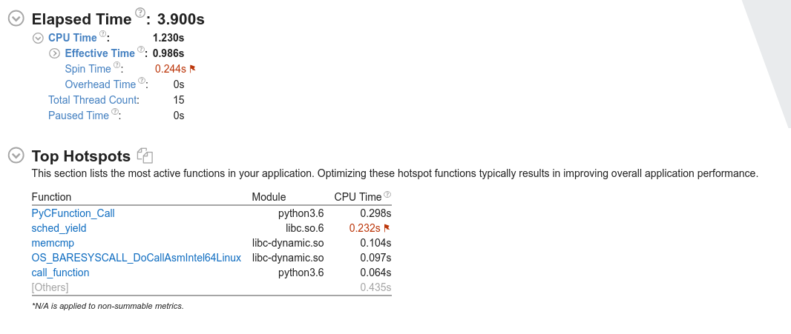
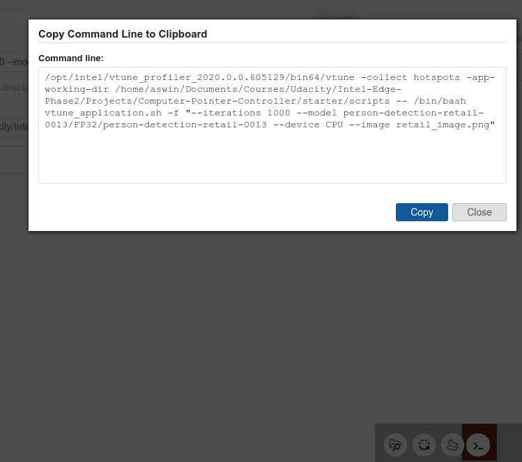

# Computer Pointer Controller

*TODO:* Write a short introduction to your project

To move the mouse pointer based on the head pose, facial landmarks that use eye coordination, detected face and gaze estimation.

## Project Set Up and Installation

*TODO:* Explain the setup procedures to run your project. For instance, this can include your project directory structure, the models you need to download and where to place them etc. Also include details about how to install the dependencies your project requires.

The virtual environment consists of: opencv, ipython, numpy and uses python 3.6 version

### Virtual Environment

```bash

    pip install virtualenv

    virtualenv .

    pip install -r requirements.txt

```

### Raising an Exception

The change in prefix path of the intel model throws up an exception

```log

    python exec.py --face="face_regular" --pose="head_pose" --landmarks="facial_landmarks" --gaze="gaze_estimation" --device=CPU --conf=0.6 --prefix="/home/workspace/ir_models" --input_file=bin/demo.mp4 --batch_size=64 --produce_batch_size=64 --output_path="output_video.avi" --input_type="video" --precisions_order="INT1,FP16,FP16,FP16"

    Traceback (most recent call last):
    File "exec.py", line 213, in <module>
        main()
    File "exec.py", line 66, in main
        model_paths, model_classes = obtain_models(args, models, precisions)
    File "/home/aswin/Documents/Courses/Udacity/Intel-Edge-Phase2/Projects/Computer-Pointer-Controller/starter/model_list.py", line 34, in obtain_models
        p = args.precisions[ii]
    AttributeError: 'Namespace' object has no attribute 'precisions'

```

__Downloading OpenVINO Models__

In order to download the OpenVINO models, `downloader.py` script is being used

```bash

    python /opt/intel/openvino/deployment_tools/tools/model_downloader/downloader.py --name face-detection-adas-binary-0001 --output_dir ./models/

    python /opt/intel/openvino/deployment_tools/tools/model_downloader/downloader.py --name head-pose-estimation-adas-0001 --output_dir ./models/

    python /opt/intel/openvino/deployment_tools/tools/model_downloader/downloader.py --name landmarks-regression-retail-0009 --output_dir ./models/

    python /opt/intel/openvino/deployment_tools/tools/model_downloader/downloader.py --name gaze-estimation-adas-0002 --output_dir ./models/

```

## Demo
*TODO:* Explain how to run a basic demo of your model.

### How to run a demo

```bash

    python exec.py --face="face" --pose="head_pose" --landmarks="facial_landmarks" --gaze="gaze_estimation" --device=CPU --conf=0.6 --prefix="/home/workspace/ir_models/intel/" --input_file=bin/demo.mp4 --batch_size=64 --produce_batch_size=64 --output_path="output_video.avi" --input_type="video" --precisions_order="INT1,FP16,FP16,FP16"

    python exec.py --face="face" --pose="head_pose" --landmarks="facial_landmarks" --gaze="gaze_estimation" --device=CPU --conf=0.6 --prefix="/home/workspace/ir_models/intel/" --input_file=bin/demo.mp4 --batch_size=4 --produce_batch_size=4 --output_path="output_video.avi" --input_type="cam" --precisions_order="INT1,FP16,FP16,FP16"

```


```log

    595  Frame(s) loading time:  2.779841423034668
    Creating Image Frame pipeline: 
    Preprocess and exec async for face detection:  2.462164878845215
    Post-process face detection:  17.501105308532715
    Preprocess and exec async for facial landmarks:  0.11006045341491699
    Post-process facial landmarks:  1.4040935039520264
    Preprocess and exec async head pose:  0.13110589981079102
    Post-process head pose:  0.8902149200439453
    Preprocess and exec async gaze estimation:  0.00014662742614746094
    Post-process gaze:  0.020793676376342773
    Post-process video writing and painting time:  6.754056930541992

```

### The command line options

exec.py

```log
    
    --face="face_regular"
    --pose="head_pose"
    --landmarks="facial_landmarks"
    --gaze="gaze_estimation"
    --device="CPU"
    --precisions_order="INT1,FP16,FP16,FP16"
    --conf="0.6"
    --prefix="/home/workspace/ir_models/intel/"
    --input_file="bin/demo.mp4"
    --batch_size="64"
    --produce_batch_size="64"
    --output_path="output_video.avi"

```

inference_layer.py

```log

    --model="head_pose" 
    --precision=FP16 
    --device=CPU 
    --image="../images/image1.png" 
    --threshold=0.6

```

inference_model.py

```log

    --models="face,head_pose,facial_landmarks,gaze_estimation" 
    --precision="FP16" 
    --device="CPU" 
    --image="../images/image1.png" 
    --prefix="/home/workspace/ir_models/intel/" 
    --iterations=100

```


### The directory structure

- models/                               The models directory

- pipeline/                             The pipeline directory containing list of pipelines:

                                        - Pipeline.py
                                        - ImageFrame.py
                                        - Face.py
                                        - Pose.py
                                        - Gaze.py

- scripts/
        
        - inference_layer.py            Measures / outputs the performance counts of each model
    
        - inference_model.py            Measures / prints out the model load time, inference time and input/output time
    
        - Network.py                    The network python class that loads the models and executes inferences

Async inferences have been used in these comamnd line scripts

- src/

        - Adapter.py                    The class that actas as a parent for inference model classes
    
        - face_detection.py             The Face detection model 
    
        - face_landmarks_detection.py   The Face landmarks detection model
    
        - gaze_estimation.py            The Gaze estimation model
    
        - head_pose_estimation.py       The Head Pose Estimation model

- exec.py                               The command line file to execute the demo 

- model_list.py                         The list of models loaded by a prefix

- images/                               The images directory that contain list of sample collected images

- output1.png                           The output image 1 of the person

- output2.png                           The output image 2 of the person

- out_vid3.gif                          The demo whitemarked animation

- output_video.gif                      The demo file to show response of the models

- mouse_pointer.gif                     The demo mouse pointer animation

### Video with Mouse Pointer


### Measurement of FPS from Input Processing

For the camera input, the FPS is calculated from the performance text as given in the how to run demo section.


## Documentation

*TODO:* Include any documentation that users might need to better understand your project code. For instance, this is a good place to explain the command line arguments that your project supports.

The `exec.py` file has used `concurrent.futures.ThreadPoolExecutor`

The models used are:

- Face Detection

- Face Landmarks Detection

- Head Pose Estimation

- Gaze Estimation

## Code Explanation


```python

def run_pipeline(logging, frames, models, model_classes, models_array, 
model_paths, args, start_time, out, save=False):

    end_time = time.time()

    face, landmarks, pose_estimation, gaze = models

    logging.info("""{f} Frame(s) loading time: {t}""".format(f=len(frames), 
    t=(end_time - start_time)))

    logging.info("Creating Image Frame pipeline: ")

    default_pipeline = Pipeline(model_type=None, model_class=None, objects={}, 
    networks={}, objs={}, nets={}, logging=logging)

    # load the network objects
    default_pipeline.run(model_classes, models_array, model_paths, args)

    image_frame = ImageFrame(model_type=face, model_class=model_classes, 
    objects=default_pipeline.objects, networks=default_pipeline.networks, 
    objs=default_pipeline.objs, nets=default_pipeline.nets)

    face_detection = Face(model_type=landmarks, model_class=model_classes.tolist()[1], 
    objects=default_pipeline.objects, networks=default_pipeline.networks, 
    objs=default_pipeline.objs, nets=default_pipeline.nets)

    gaze_estimation = Gaze(model_type=gaze, model_class=model_classes.tolist()[3], 
    objects=default_pipeline.objects, networks=default_pipeline.networks, 
    objs=default_pipeline.objs, nets=default_pipeline.nets)

    start_time = time.time()

    image_frame.run(args, frames, model_classes)

    logging.info("""Preprocess and exec async for face detection: {t}""".format(t=(time.time() - start_time)))

    # for each n batches and for each batch_size
    start_time = time.time()

    gen_frames, faces, face_boxes = \
        image_frame.produce(args, frames, model_classes)

    logging.info("""Post-process face detection: {t}""".format(t=(time.time() - start_time)))

    start_time = time.time()
    
    face_detection.run(args, frames, faces, model_classes)

    logging.info("""Preprocess and exec async for facial landmarks: {t}""".format(t=(time.time() - start_time)))

    start_time = time.time()

    batch_gen_frames, cropped_left, \
        cropped_right, left_eye, right_eye, \
        nose, left_lip, right_lip = \
            face_detection.produce(args, frames, gen_frames, faces, face_boxes, 
    model_classes)

    logging.info("""Post-process facial landmarks: {t}""".format(t=(time.time() - start_time)))

    start_time = time.time()

    pose_model = Pose(model_type=pose_estimation, 
    model_class=model_classes.tolist()[2], 
    objects=default_pipeline.objects, networks=default_pipeline.networks, 
    objs=default_pipeline.objs, nets=default_pipeline.nets)

    pose_model.run(args, frames, faces, model_classes)
    
    logging.info("""Preprocess and exec async head pose: {t}""".format(t=(time.time() - start_time)))

    start_time = time.time()

    head_pose_angles = pose_model.produce(args, frames, 
    batch_gen_frames, model_classes)

    logging.info("""Post-process head pose: {t}""".format(t=(time.time() - start_time)))

    gen_frames = None

    start_time = time.time()
    # preprocessing the gaze and executing the landmarks detection
    gaze_estimation.run(args, frames, faces, 
    cropped_left, cropped_right, 
    head_pose_angles, model_classes)

    logging.info("""Preprocess and exec async gaze estimation: {t}""".format(t=(time.time() - start_time)))

    faces = None

    start_time = time.time()
    # post process gaze vector
    gaze_vector = gaze_estimation.produce(args, frames, batch_gen_frames, 
    model_classes)

    logging.info("""Post-process gaze: {t}""".format(t=(time.time() - start_time)))

    start_time = time.time()
    ext = os.path.splitext(args.output_path)[1]

    if ext in is_video():
        default_pipeline.finalize_pipeline(out, frames, 
        args, batch_gen_frames, face_boxes, 
        left_eye, right_eye, 
        nose, left_lip, right_lip, 
        gaze_vector, save=save)
    else:
        frame = default_pipeline.write_pipeline(0, frames, batch_gen_frames, face_boxes, 
        left_eye, right_eye, nose, left_lip, right_lip, 
        gaze_vector)
        cv2.imwrite(out, frame)

    logging.info("""Post-process video writing and painting time: {t}""".format(t=(time.time() - start_time)))

    return batch_gen_frames

```

## Based on user input

If you pass input_type as video, then the input video is used, otherwise in the cases where input_type is passed in as cam, the camera feed is used.

exec.py

```log
    
    --face="face_regular"
    --pose="head_pose"
    --landmarks="facial_landmarks"
    --gaze="gaze_estimation"
    --device="CPU"
    --precisions_order="INT1,FP16,FP16,FP16"
    --conf="0.6"
    --prefix="/home/workspace/ir_models/intel/"
    --input_file="bin/demo.mp4"
    --batch_size="64"
    --produce_batch_size="64"
    --output_path="output_video.avi"
    --input_type="video"
    --video_len=595

```

## Benchmarks
*TODO:* Include the benchmark results of running your model on multiple hardwares and multiple model precisions. Your benchmarks can include: model loading time, input/output processing time, model inference time etc.

```bash

    cd scripts/

    # Face Detection, Head Pose Estimation, Facial Landmarks Detection, Gaze Estimation

    python inference_model.py --models "face,head_pose,facial_landmarks,gaze_estimation" --precision "FP16" --device "CPU" --image "../images/image1.png" --prefix "/home/workspace/ir_models/intel/" --iterations 100

    Model...:  face
    Model Load Time is:  0.2290022373199463
    Inference Time is:  0.0218103551864624
    Input/Output Time is:  0.0008311271667480469

    Model...:  head_pose
    Model Load Time is:  0.09927248954772949
    Inference Time is:  0.0018021202087402345
    Input/Output Time is:  0.00013875961303710938

    Model...:  facial_landmarks
    Model Load Time is:  0.42183756828308105
    Inference Time is:  0.003168463706970215
    Input/Output Time is:  0.00013375282287597656
    
    Model...:  gaze_estimation
    Model Load Time is:  0.13030791282653809
    Inference Time is:  0.0023927545547485353
    Input/Output Time is:  0.00022840499877929688

```


## Results (Benchmarking results for models of different precisions)

*TODO:* Discuss the benchmark results and explain why you are getting the results you are getting. For instance, explain why there is difference in inference time for FP32, FP16 and INT8 models.

### Face Detection, Face Landmarks Detection, Gaze Estimation, Head Pose Estimation

```log

    Precision:  FP16
    Model...:  face
    Model Load Time is:  1.2867493629455566
    Inference Time is:  0.0026137804985046386
    Input/Output Time is:  0.017719745635986328

    Model...:  head_pose
    Model Load Time is:  0.7920746803283691
    Inference Time is:  0.003512754440307617
    Input/Output Time is:  0.00013685226440429688

    Model...:  facial_landmarks
    Model Load Time is:  0.2831246852874756
    Inference Time is:  0.002412700653076172
    Input/Output Time is:  0.0002562999725341797

```

```log

    Precision:  FP32
    Model...:  face
    Model Load Time is:  0.30683088302612305
    Inference Time is:  0.002059483528137207
    Input/Output Time is:  0.00015091896057128906

    Model...:  head_pose
    Model Load Time is:  0.6290264129638672
    Inference Time is:  0.003314807415008545
    Input/Output Time is:  0.00013494491577148438

    Model...:  facial_landmarks
    Model Load Time is:  0.33220458030700684
    Inference Time is:  0.0025447630882263184
    Input/Output Time is:  0.00022602081298828125

```

```log

    Precision:  INT1
    Model...:  face
    Model Load Time is:  0.31473755836486816
    Inference Time is:  0.017162725925445557
    Input/Output Time is:  0.0005006790161132812

```

```log

    Precision:  INT8
    Model...:  face
    Model Load Time is:  0.2635071277618408
    Inference Time is:  0.0015732979774475098
    Input/Output Time is:  0.00023293495178222656

```

## Stand Out Suggestions
This is where you can provide information about the stand out suggestions that you have attempted.

[./scripts/perf_counts_face-det.log](./scripts/perf_counts_face-det.log)


### Async Inference
If you have used Async Inference in your code, benchmark the results and explain its effects on power and performance of your project.

Compute Power
-------------

Compute Power is dependent on CPU Time or Compute Time, 


```bash

    python inference_layer.py --model "head_pose" --precision FP16 --device CPU --image "../images/image1.png" --threshold 0.6 > perf_counts_FP16_head_pose.log

```


### Edge Cases
There will be certain situations that will break your inference flow. For instance, lighting changes or multiple people in the frame. Explain some of the edge cases you encountered in your project and how you solved them to make your project more robust.

/opt/intel/vtune_profiler_2020.0.0.605129/bin64/vtune -collect hotspots -app-working-dir /home/aswin/Documents/Courses/Udacity/Intel-Edge-Phase2/Projects/Computer-Pointer-Controller/starter/scripts -- /bin/bash vtune_application.sh -f "--iterations 1000 --model person-detection-retail-0013/FP32/person-detection-retail-0013 --device CPU --image retail_image.png"






### Lighting and Performance

**Lighting is dependent on the mean normalized values. It can be represented as the ratio of steadily increasing numerator vs steadily increasing denominator in the cases where the brightness of the image increases. It is observed that when the brightness increases the accuracy of the model decreases, and it is the reverse otherwise.**

**The performance of the model as well reduces based on detections. The performance of the model is dependent on the ground truth of the data. When the ground truth of the data is altered, the time of execution of the model is reduced due to mean normalization of the image.**

### Multiple People in Frame

In the cases where there are multiple people in the frame, the performance counts is reduced. 